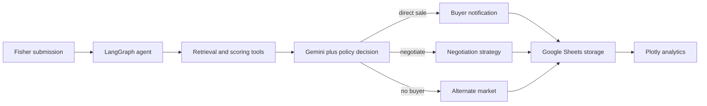

# MatsyaLink AI

MatsyaLink AI is an autonomous market-access and buyer-matching prototype for
small-scale artisanal fishers. It supports **UN SDG 14.b** by turning a catch
submission into an explainable sale, negotiation, or alternate-market action.

The core is a LangGraph state machine with real conditional edges, tool
execution, structured Gemini reasoning, Gmail notification, Google Sheets
persistence, and transaction analytics. It is not a chatbot or a CRUD wrapper.

## Documentation

- [Documentation center](docs/README.md)
- [Developer handbook](docs/DEVELOPER_GUIDE.md)
- [Consumer guide and deliverable](docs/CONSUMER_DELIVERABLE.md)
- [Architecture reference](docs/architecture.md)
- [Fifteen-phase delivery checklist](docs/phase-checklist.md)

## What the demo proves

- Validates and normalizes a fisher's catch submission.
- Classifies freshness and selling urgency from catch age and quantity.
- Retrieves only stored markets and buyers—never model-invented records.
- Ranks buyers with visible 35/25/20/10/10 weighted components.
- Uses guardrailed Gemini structured output when enabled.
- Routes to direct sale, negotiation, or alternate-market branches.
- Sends a templated buyer offer through Gmail SMTP on direct-sale routes.
- Persists every run and generates live Plotly dashboard metrics.
- Streams each LangGraph node update to the Streamlit interface.

See [the detailed architecture](docs/architecture.md) and the
[phase-by-phase delivery checklist](docs/phase-checklist.md).

## Architecture



## Folder structure

```text
MatsyaLink-AI/
├── config.py                       # environment and integration switches
├── models.py                       # Fisher, Catch, Market, Buyer, etc.
├── state.py                        # strongly typed LangGraph state
├── prompts.py                      # grounded Gemini and email prompts
├── tools.py                        # six graph-callable tools
├── repositories.py                 # Google Sheets + local CSV adapters
├── nodes.py                        # eleven dedicated workflow node functions
├── graph.py                        # StateGraph and conditional edges
├── templates/
│   ├── frontend.py                 # four-page Streamlit experience
│   └── layout.html                 # skeletal, zero-CSS HTML shell
├── data/
│   ├── market_prices.csv           # 15 market records
│   ├── buyers.csv                  # 20 buyer records
│   ├── transactions.csv            # local transaction mirror
│   └── demo_scenarios.json         # three required paths
├── scripts/
│   ├── run_demo.py                 # presentation-friendly scenario runner
│   └── seed_google_sheets.py       # provisions all three sheet tabs
├── tests/                          # graph-route and tool tests
├── docs/architecture.md
├── requirements.txt
└── .env.example
```

All frontend source lives in `templates/`. The HTML file is intentionally
skeletal and contains zero CSS, as required. The Streamlit UI uses only native
components and adds no custom styling.

## Local deployment

Python 3.11 or newer is recommended.

```powershell
python -m venv .venv
.venv\Scripts\Activate.ps1
python -m pip install -r requirements.txt
Copy-Item .env.example .env
streamlit run templates/frontend.py
```

The default configuration needs no external credentials. It uses bundled CSV
records, deterministic policy reasoning, and email dry-run, so all three paths
can be demonstrated immediately.

Run automated tests and the narrated scenarios:

```powershell
python -m pytest -q
python scripts/run_demo.py
```

## Google Sheets setup

1. Create a Google Cloud service account and enable the Google Sheets API.
2. Create a workbook and share it with the service-account email as Editor.
3. Copy `.env.example` to `.env` and set `GOOGLE_SHEET_ID` plus either
   `GOOGLE_SERVICE_ACCOUNT_FILE` or `GOOGLE_SERVICE_ACCOUNT_JSON`.
4. Seed the exact required tabs:

```powershell
python scripts/seed_google_sheets.py
```

5. Set `USE_GOOGLE_SHEETS=true` and restart Streamlit.

The tabs are `Market Prices`, `Buyers`, and `Transactions`. Keep the seeded
headers unchanged. The repository abstraction makes moving to a production
database a localized change.

## Gemini setup

Set these values in `.env` and restart the app:

```dotenv
GEMINI_ENABLED=true
GEMINI_API_KEY=your_api_key
GEMINI_MODEL=gemini-2.5-flash
```

Gemini returns the `DecisionOutput` schema. The node rejects an output if its
decision violates price policy or if a buyer/market ID is absent from retrieved
records. The deterministic fallback keeps the demo operational during API
failure or quota exhaustion. This follows the official guidance to validate
structured output semantically after generation:
[Gemini structured output](https://ai.google.dev/gemini-api/docs/structured-output).

## Gmail SMTP setup

Enable two-step verification on the sender Google account and create an app
password. Then set:

```dotenv
EMAIL_DRY_RUN=false
SMTP_USERNAME=sender@gmail.com
SMTP_PASSWORD=your_16_character_app_password
SMTP_SENDER=sender@gmail.com
```

Only the direct-sale route sends mail. Negotiation and fallback paths deliberately
do not contact a buyer. For judging, `EMAIL_DRY_RUN=true` shows the full generated
offer without creating an external side effect.

## Matching formula

| Component | Weight | Normalization |
|---|---:|---|
| Offered price vs. matching-market reference | 35% | capped at 100 |
| Distance within fisher's maximum | 25% | linearly decreases to zero |
| Current buyer demand | 20% | High 100, Medium 65, Low 25 |
| Capacity vs. catch quantity | 10% | fulfilled fraction, capped at 100 |
| Freshness compatibility | 10% | 100, 40, or 0 by buyer tolerance |

Expected revenue is `min(catch quantity, buyer capacity) × offered price`. Every
component and the explanation appear in Agent Analysis.

## Three presentation scenarios

1. **Mackerel / INR 280 minimum:** high-demand eligible buyer meets the price,
   so the graph creates a direct proposal, notifies, and stores the sale.
2. **Tuna / INR 700 minimum:** buyers exist but every stored offer is lower,
   so the graph produces a negotiation strategy and stores it without email.
3. **Rohu:** matching markets exist but the buyer sheet intentionally has no
   Rohu buyer, so the graph recommends the best alternate market and stores it.

## Production-inspired safeguards

- Pydantic validates all external and persisted records.
- Append-only state logs provide node-level traceability.
- LangGraph `InMemorySaver` provides per-thread checkpoints for the prototype.
- Cloud failures degrade safely; no synthetic market data is created.
- SMTP defaults to dry-run and credentials stay in environment variables.
- Repository and tool boundaries are ready for retries, observability, and a
  durable LangGraph checkpointer in a production iteration.

LangGraph's graph API and conditional routing are documented in the
[official LangGraph Graph API guide](https://docs.langchain.com/oss/python/langgraph/graph-api).
