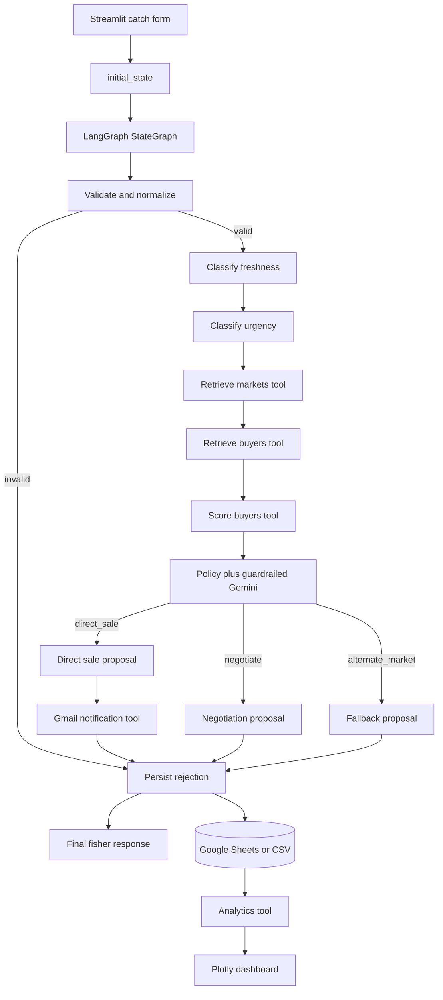

# MatsyaLink AI developer handbook

**Document type:** Engineering reference  
**Project:** MatsyaLink AI  
**Purpose:** Production-inspired hackathon prototype for SDG 14.b  
**Primary runtime:** Python 3.11+  
**Orchestration framework:** LangGraph only  
**Last reviewed against source:** 20 July 2026

## 1. Purpose and engineering scope

MatsyaLink AI is an autonomous market-access workflow for small-scale artisanal
fishers. It accepts a catch, retrieves eligible market and buyer records, scores
buyers, chooses an action, optionally contacts a buyer, persists the execution,
and updates analytics.

The application is deliberately more than a form-and-database system. Its core
behavior is a typed LangGraph state machine with conditional routing. The model
is used inside a constrained decision boundary; it does not create marketplace
entities and cannot override price policy.

This handbook is for developers who need to:

- understand the runtime from submission to persistence;
- modify a node, tool, model, repository, or route safely;
- configure Gemini, Google Sheets, or Gmail;
- diagnose an execution from its append-only trace;
- run and extend the tests;
- prepare the prototype for a more durable deployment.

### In scope

- Catch intake and validation
- Freshness and urgency classification
- Market and buyer retrieval
- Explainable buyer ranking
- Direct-sale, negotiation, and fallback routing
- Buyer email composition and Gmail SMTP delivery
- Google Sheets or CSV persistence
- Transaction analytics
- Streamlit presentation layer

### Explicitly out of scope

- Authentication and authorization
- Payments or settlement
- Live fisheries and weather feeds
- Route or transport optimization
- Mobile-native clients
- Inventory reservations and concurrent order locking
- Regulatory compliance automation
- Enterprise secrets, queues, or distributed infrastructure

## 2. Runtime architecture



### Architectural principles

1. **LangGraph owns orchestration.** No alternate agent or workflow framework is
   present.
2. **State is explicit.** Nodes exchange typed state updates rather than hidden
   module-level conversation memory.
3. **Retrieval precedes reasoning.** The decision node sees only records already
   returned by tools.
4. **Policy constrains the model.** Deterministic rules establish the allowed
   outcome before Gemini produces an explanation.
5. **Cloud services are adapters.** CSV, deterministic reasoning, and dry-run
   email keep local demos operational without credentials.
6. **Every route converges on storage.** Valid business outcomes and rejected
   submissions are represented in the transaction ledger.
7. **Logs are append-only.** The `operator.add` reducer preserves the ordered
   node trace.

## 3. Repository map

```text
G:\Hackathons\IBM\
├── config.py
├── models.py
├── state.py
├── prompts.py
├── tools.py
├── repositories.py
├── nodes.py
├── graph.py
├── requirements.txt
├── .env.example
├── data/
│   ├── market_prices.csv
│   ├── buyers.csv
│   ├── transactions.csv
│   └── demo_scenarios.json
├── templates/
│   ├── frontend.py
│   └── layout.html
├── scripts/
│   ├── run_demo.py
│   └── seed_google_sheets.py
├── tests/
│   ├── conftest.py
│   ├── test_tools.py
│   └── test_workflows.py
└── docs/
    ├── README.md
    ├── DEVELOPER_GUIDE.md
    ├── CONSUMER_DELIVERABLE.md
    ├── architecture.md
    └── phase-checklist.md
```

### Module responsibilities

| Module | Responsibility | May perform side effects |
|---|---|---:|
| `config.py` | Environment parsing, paths, readiness flags | Reads environment and `.env` |
| `models.py` | Domain and Gemini output validation | No |
| `state.py` | Graph state contract, log reducer, initialization | No |
| `prompts.py` | System, decision, and email templates | No |
| `tools.py` | Retrieval, score, SMTP, storage, analytics capabilities | Yes |
| `repositories.py` | Google Sheets and CSV storage implementations | Yes |
| `nodes.py` | State transformations and tool execution | Through tools |
| `graph.py` | Node registration, conditional edges, compilation | Checkpoint writes in memory |
| `templates/frontend.py` | Four-view Streamlit experience | Invokes graph and analytics |
| `scripts/run_demo.py` | Three deterministic demonstration workflows | Appends transactions |
| `scripts/seed_google_sheets.py` | Provisions the three workbook tabs | Replaces tab contents |

## 4. Installation and local development

### Prerequisites

- Python 3.11 or newer
- PowerShell, Bash, or another shell
- Internet access only for dependency installation and optional cloud services
- Optional Gemini API key
- Optional Google service account and workbook
- Optional Gmail account with an app password

### Setup on Windows

```powershell
cd G:\Hackathons\IBM
python -m venv .venv
.venv\Scripts\Activate.ps1
python -m pip install --upgrade pip
python -m pip install -r requirements.txt
Copy-Item .env.example .env
python -m pytest -q
streamlit run templates/frontend.py
```

### Setup on macOS or Linux

```bash
python3 -m venv .venv
source .venv/bin/activate
python -m pip install --upgrade pip
python -m pip install -r requirements.txt
cp .env.example .env
python -m pytest -q
streamlit run templates/frontend.py
```

The default `.env.example` values deliberately select:

- local CSV storage;
- deterministic decision rationale;
- email dry-run.

This is the recommended first run because it exercises the full graph without
external credentials or irreversible communication.

## 5. Domain model reference

All domain classes inherit from `DomainModel`, a Pydantic model configured to:

- strip surrounding whitespace from strings;
- validate assignments;
- allow additional fields for future-compatible records.

### Enumerations

| Enum | Values | Used by |
|---|---|---|
| `FreshnessStatus` | `Fresh`, `Moderate`, `Low Freshness` | Catch classification and compatibility |
| `UrgencyLevel` | `Low`, `Medium`, `High` | Sale urgency |
| `DecisionType` | `direct_sale`, `negotiate`, `alternate_market`, `rejected` | Routing and persistence |
| `DemandLevel` | `Low`, `Medium`, `High` | Buyer and market demand |

### `Fisher`

| Field | Type | Constraint/default |
|---|---|---|
| `fisher_id` | string | Generated `F-xxxxxxxx` |
| `name` | string | 2–120 characters |
| `contact_number` | string | 7–20 characters |
| `location` | string | 2–160 characters |
| `cooperative_name` | optional string | `None` |

### `Catch`

| Field | Type | Constraint/default |
|---|---|---|
| `catch_id` | string | Generated `C-xxxxxxxx` |
| `fisher` | `Fisher` | Required |
| `fish_type` | string | 2–80 characters; title-normalized |
| `quantity_kg` | float | Greater than 0; at most 100,000 |
| `catch_time` | datetime | Naive input is treated as UTC |
| `expected_min_price_per_kg` | float | 0–1,000,000 |
| `max_travel_distance_km` | float | Greater than 0; at most 2,000 |
| `grade` | optional string | Reserved for future grading |

### `Market`

| Field | Type | Meaning |
|---|---|---|
| `market_id` | string | Stable sheet identifier |
| `market_name` | string | Display name |
| `location` | string | Market locality |
| `fish_type` | string | Price-record category |
| `distance_km` | float | Prototype distance from target fishing area |
| `current_demand` | `DemandLevel` | Stored demand band |
| `current_price_per_kg` | float | INR/kg benchmark |
| `updated_at` | optional datetime | Observation time |

`MarketPrice` is a future-facing normalized price entity. The prototype market
sheet embeds the current price in each `Market` record.

### `Buyer`

| Field | Type | Meaning |
|---|---|---|
| `buyer_id` | string | Stable sheet identifier |
| `buyer_name` | string | Business or cooperative name |
| `accepted_fish_types` | list of strings | Pipe- or comma-separated sheet input is accepted |
| `capacity_kg` | float | Currently available capacity |
| `location` | string | Buyer locality |
| `distance_km` | float | Prototype distance from target fishing area |
| `price_offered_per_kg` | float | Stored INR/kg offer |
| `contact_email` | email | Validated buyer recipient |
| `current_demand` | `DemandLevel` | Active demand band |
| `freshness_acceptance` | `FreshnessStatus` | Minimum acceptable freshness class |

### Results and records

- `BuyerScore` contains the total score, all five normalized components,
  expected revenue, and a readable rationale.
- `MatchResult` represents a complete match independent of graph state and is
  available for future API boundaries.
- `Notification` represents a composed or delivered message.
- `Transaction` is the persisted execution record.
- `DecisionOutput` is the restricted schema accepted from Gemini.

## 6. LangGraph state contract

`AgentState` is a `TypedDict` with optional keys so LangGraph can apply partial
node updates. `initial_state()` initializes every supported key for predictable
UI rendering and test assertions.

| State field | Type | Primary owner | Description |
|---|---|---|---|
| `raw_submission` | dictionary | Initializer | Untrusted UI or API payload |
| `validated_submission` | dictionary or null | Validation | Canonical serialized `Catch` |
| `fish_type` | string | Validation | Normalized fish category |
| `quantity` | float | Validation | Normalized kilograms |
| `freshness_status` | string | Freshness | Three-band catch freshness |
| `urgency_level` | string | Urgency | Low, Medium, or High |
| `available_markets` | list | Market retrieval | Distance-filtered retrieved records |
| `available_buyers` | list | Buyer retrieval | Type, demand, distance, capacity filtered records |
| `buyer_scores` | list | Buyer scoring | Descending explainable rankings |
| `selected_buyer` | dictionary or null | Decision | Retrieved buyer only |
| `selected_market` | dictionary or null | Decision | Retrieved fallback/best market |
| `expected_revenue` | float | Decision | Buyer- or market-based estimate |
| `decision` | dictionary | Decision | Type, explanation, strategy, source |
| `notification_content` | dictionary | Proposal | Recipient, subject, and body |
| `execution_logs` | append-only list | All nodes | Ordered trace using `operator.add` |
| `final_response` | string | Response | Fisher-facing outcome |
| `agent_status` | string | Current node | Coarse workflow lifecycle |
| `proposal` | dictionary | Proposal | Branch-specific recommended action |
| `notification_status` | string | Notification | `not_started`, `dry_run`, `sent`, or `failed` |
| `transaction_id` | string | Persistence | Stable trace identifier |
| `validation_errors` | list of strings | Validation | User-correctable failures |

### Log event shape

```json
{
  "timestamp": "2026-07-20T10:00:00+00:00",
  "node": "buyer_scoring",
  "status": "completed",
  "message": "Ranked 4 buyer(s) with the weighted scoring model.",
  "details": {"market_reference_price": 306.67}
}
```

Do not replace `execution_logs` with a mutable shared list. Each node returns a
one-element list; LangGraph's reducer appends it to the existing history.

## 7. Graph topology and route contracts

`build_graph(with_memory=True)` registers the nodes, adds normal and conditional
edges, and compiles the graph with `InMemorySaver`. Pass `with_memory=False` in
isolated unit tests that do not require thread checkpoints.

### Validation route

```text
submission_validation
├── validated_submission exists → freshness_analysis
└── validation failed            → persistence → response → END
```

Rejected executions receive a `DecisionType.REJECTED` transaction inside the
persistence node even though the decision node was not reached.

### Business route

```text
decision
├── direct_sale      → direct_sale_proposal → notification → persistence
├── negotiate        → negotiation_proposal ───────────────→ persistence
└── alternate_market → fallback_proposal ──────────────────→ persistence
                                                            ↓
                                                         response → END
```

Only the direct-sale branch reaches the notification node. This prevents a
below-expectation offer from being presented to a buyer as already accepted.

### Invocation

```python
from uuid import uuid4

from graph import build_graph
from state import initial_state

app = build_graph(with_memory=True)
thread_id = str(uuid4())
config = {"configurable": {"thread_id": thread_id}}

result = app.invoke(initial_state(raw_submission), config=config)
```

### Streaming updates

```python
for update in app.stream(
    initial_state(raw_submission),
    config=config,
    stream_mode="updates",
):
    for node_name, state_delta in update.items():
        print(node_name, state_delta.get("agent_status"))
```

After streaming, retrieve the complete checkpointed state with:

```python
result = dict(app.get_state(config).values)
```

Never reuse a `thread_id` for unrelated catches because checkpoint state is
keyed by thread.

## 8. Node-by-node reference

### 8.1 Submission validation

**Reads:** `raw_submission`  
**Writes:** `validated_submission`, `fish_type`, `quantity`,
`validation_errors`, lifecycle/log fields  
**Tools:** none

Accepted input aliases include human-readable labels such as `Fisher Name` and
canonical keys such as `fisher_name`. The node constructs `Fisher` and `Catch`
models and serializes the result. Pydantic errors are converted to displayable
field messages. It does not raise a validation error into the graph.

### 8.2 Freshness analysis

**Reads:** `validated_submission`  
**Writes:** `freshness_status`, lifecycle/log fields

Catch age uses `APP_TIMEZONE`:

| Catch age | Classification |
|---:|---|
| 0–6 hours | Fresh |
| More than 6 through 12 hours | Moderate |
| More than 12 hours | Low Freshness |

Future catch times are clamped to zero elapsed hours.

### 8.3 Urgency analysis

**Reads:** `freshness_status`, `quantity`  
**Writes:** `urgency_level`, lifecycle/log fields

Rules are evaluated in priority order:

1. Low Freshness or quantity at least 750 kg → High.
2. Moderate freshness or quantity at least 300 kg → Medium.
3. Otherwise → Low.

### 8.4 Market retrieval

**Reads:** validated catch  
**Writes:** `available_markets`, lifecycle/log fields  
**Tool:** `get_market_prices`

The tool performs case-insensitive exact fish-type matching. The node then
removes records beyond the fisher's maximum travel distance.

### 8.5 Buyer retrieval

**Reads:** validated catch  
**Writes:** `available_buyers`, lifecycle/log fields  
**Tool:** `get_available_buyers`

The tool requires the stored accepted-fish list to contain the fish type and
excludes Low-demand records. The node additionally enforces maximum travel
distance and positive capacity.

### 8.6 Buyer scoring

**Reads:** catch, freshness, markets, buyers  
**Writes:** `buyer_scores`, lifecycle/log fields  
**Tool:** `calculate_buyer_score`

The market reference is the arithmetic mean of eligible market prices. If no
market is eligible, the fisher's expected minimum becomes the reference. Scores
are sorted by descending total and then buyer name for deterministic ties.

### 8.7 Decision

**Reads:** catch, freshness, urgency, markets, buyers, scores  
**Writes:** selection, expected revenue, decision, lifecycle/log fields  
**External reasoning:** optional Gemini

The decision node first establishes a policy outcome:

1. Find the highest-ranked buyer with nonzero freshness compatibility.
2. If none exists, choose `alternate_market`.
3. If the chosen offer meets or exceeds the fisher's minimum, choose
   `direct_sale`.
4. Otherwise choose `negotiate`.

The best market is ordered by price descending, demand descending, and distance
ascending. Gemini may provide the explanation and negotiation strategy, but the
output is accepted only when:

- its decision equals the policy outcome;
- every non-null buyer ID exists in retrieved buyers;
- every non-null market ID exists in retrieved markets.

Any Gemini exception or rejected output uses deterministic text and records
`reasoning_source=deterministic_policy`.

### 8.8 Proposal generation

One function is registered as three named graph nodes so the execution trace
shows the selected route.

- Direct sale creates a proposal and a complete email payload.
- Negotiation creates a target, listed offer, and practical strategy.
- Fallback recommends the best retrieved market or the local cooperative when
  no market exists.

### 8.9 Notification

**Reads:** `notification_content`  
**Writes:** `notification_status`, lifecycle/log fields  
**Tool:** `send_buyer_notification`

Dry-run is returned when SMTP is disabled or incomplete. SMTP errors are caught
by the node and represented as `failed`; persistence still executes.

### 8.10 Persistence

**Reads:** the complete accumulated state  
**Writes:** `transaction_id`, lifecycle/log fields  
**Tool:** `save_transaction`

The node converts state into a validated `Transaction`. Storage errors are
logged and do not prevent final-response generation. On a failure, the locally
generated transaction ID remains available for support correlation even though
it was not durably written.

### 8.11 Response

**Reads:** validation errors or completed decision/proposal  
**Writes:** `final_response`, lifecycle/log fields

The response is deterministic and includes the decision, auditable explanation,
expected revenue, recommended action, and transaction trace ID.

## 9. Tool catalog

All six public capabilities are decorated with `@tool` and collected in
`AGENT_TOOLS`.

| Tool | Input | Output | Side effect |
|---|---|---|---|
| `get_market_prices` | `fish_type` | Validated matching markets | Reads storage |
| `get_available_buyers` | `fish_type` | Validated active buyers | Reads storage |
| `calculate_buyer_score` | Buyer, catch, travel, freshness, benchmark | `BuyerScore` dictionary | None |
| `send_buyer_notification` | Recipient, subject, body | Delivery result | Optional SMTP email |
| `save_transaction` | Transaction dictionary | Status and ID | Appends ledger row |
| `generate_analytics` | None | Dashboard metrics | Reads transactions |

Invoke decorated tools with `.invoke()`:

```python
from tools import get_market_prices

markets = get_market_prices.invoke({"fish_type": "Mackerel"})
```

Direct Python calls bypass the tool interface and are not the supported graph
invocation pattern.

## 10. Matching algorithm

### Formula

```text
total = price_score      × 0.35
      + distance_score   × 0.25
      + demand_score     × 0.20
      + capacity_score   × 0.10
      + freshness_score  × 0.10
```

All components and the total are in the 0–100 range.

### Component definitions

```text
price_score = min(buyer_offer / market_reference, 1) × 100

distance_score = max(
    0,
    100 × (1 - buyer_distance / fisher_max_distance)
)

demand_score = High: 100, Medium: 65, Low: 25

capacity_score = min(buyer_capacity / catch_quantity, 1) × 100
```

Freshness uses ordinal ranks:

```text
Low Freshness = 1
Moderate      = 2
Fresh         = 3
```

If supplied freshness meets the buyer's minimum, compatibility is 100. One band
below is 40; two bands below is 0. A zero-compatibility buyer cannot be selected,
even if another component gives it a high total.

Expected revenue is:

```text
min(buyer_capacity_kg, catch_quantity_kg) × buyer_price_per_kg
```

For alternate markets:

```text
catch_quantity_kg × selected_market_current_price_per_kg
```

### Worked example

Assume a 250 kg catch, 40 km maximum travel distance, INR 300 market reference,
and a buyer offering INR 315/kg at 8 km with High demand, 1,000 kg capacity, and
full freshness compatibility.

| Component | Raw score | Weight | Contribution |
|---|---:|---:|---:|
| Price | 100 | 35% | 35.0 |
| Distance | 80 | 25% | 20.0 |
| Demand | 100 | 20% | 20.0 |
| Capacity | 100 | 10% | 10.0 |
| Freshness | 100 | 10% | 10.0 |
| **Total** | | | **95.0** |

Expected revenue is `250 × 315 = INR 78,750`.

## 11. Gemini integration

Gemini is optional and disabled by default.

```dotenv
GEMINI_ENABLED=true
GEMINI_API_KEY=your_key
GEMINI_MODEL=gemini-2.5-flash
```

The implementation uses `google-genai` and a `GenerateContentConfig` with:

- temperature `0.1`;
- JSON response MIME type;
- Pydantic `DecisionOutput` response schema.

The prompt receives serialized catch, route policy, eligible records, and
ordered scores. It is not given permission to broaden the candidate set.

### Model trust boundary

Gemini does not:

- retrieve storage records;
- calculate authoritative scores;
- send email;
- save a transaction;
- change the allowed route;
- introduce a new buyer or market ID.

Gemini may:

- make the rationale more natural and context-aware;
- summarize evidence;
- produce a concise negotiation strategy.

This division preserves a visible reasoning model while keeping consequential
actions reproducible.

## 12. Storage architecture

`MarketplaceRepository` defines four operations:

```python
get_markets()
get_buyers()
save_transaction(record)
get_transactions()
```

`get_repository()` selects `GoogleSheetsRepository` only when all required
configuration is present. Otherwise it returns `CSVRepository`.

### Market Prices sheet schema

| Column | Required | Example |
|---|---:|---|
| `market_id` | Yes | `MKT-004` |
| `market_name` | Yes | `Margao Wholesale Fish Market` |
| `location` | Yes | `Margao Goa` |
| `fish_type` | Yes | `Mackerel` |
| `distance_km` | Yes | `10` |
| `current_demand` | Yes | `High` |
| `current_price_per_kg` | Yes | `310` |
| `updated_at` | Recommended | ISO-8601 datetime |

### Buyers sheet schema

| Column | Required | Example |
|---|---:|---|
| `buyer_id` | Yes | `BUY-005` |
| `buyer_name` | Yes | `Goa Seafoods Collective` |
| `accepted_fish_types` | Yes | `Mackerel|Prawns` |
| `capacity_kg` | Yes | `1000` |
| `location` | Yes | `Margao Goa` |
| `distance_km` | Yes | `8` |
| `price_offered_per_kg` | Yes | `315` |
| `contact_email` | Yes | `buyer@example.com` |
| `current_demand` | Yes | `High` |
| `freshness_acceptance` | Yes | `Moderate` |

### Transactions sheet schema

Column order is fixed by `TRANSACTION_COLUMNS`:

1. `transaction_id`
2. `timestamp`
3. `submission`
4. `decision`
5. `selected_buyer`
6. `selected_market`
7. `fish_type`
8. `quantity_kg`
9. `expected_revenue`
10. `outcome`
11. `notification_status`
12. `execution_log`

Nested submission and log values are stored as JSON strings.

### Google Sheets provisioning

1. Enable the Google Sheets API in a Google Cloud project.
2. Create a service account.
3. Create a workbook and share it with the service-account email as Editor.
4. Configure the workbook ID and credentials in `.env`.
5. Run:

```powershell
python scripts/seed_google_sheets.py
```

6. Set `USE_GOOGLE_SHEETS=true` and restart the application.

The seeding script clears and replaces the contents of all three named tabs.
Do not run it against a workbook containing transaction history that must be
retained.

### Local CSV behavior

- Market and buyer data are read with UTF-8 BOM tolerance.
- Transaction appends use a process-local lock.
- CSV is suitable for one-process demonstrations, not concurrent production
  workloads.
- Tests monkeypatch the tool repository to a temporary directory, preserving
  the checked-in historical dashboard records.

## 13. Email automation

Email generation and email delivery are intentionally separate.

1. The proposal node fills `EMAIL_SUBJECT_TEMPLATE` and
   `EMAIL_BODY_TEMPLATE`.
2. The direct-sale route enters the notification node.
3. `send_buyer_notification` checks `Settings.email_ready`.
4. In dry-run it returns metadata without opening a network connection.
5. In live mode it opens SMTP, starts TLS, authenticates, and sends the message.

### Gmail configuration

```dotenv
EMAIL_DRY_RUN=false
SMTP_HOST=smtp.gmail.com
SMTP_PORT=587
SMTP_USERNAME=sender@gmail.com
SMTP_PASSWORD=google_app_password
SMTP_SENDER=sender@gmail.com
```

Use a Google app password rather than the primary account password. Keep `.env`
and service-account files out of version control.

### Delivery states

| Status | Meaning |
|---|---|
| `not_started` | Route does not send or notification has not run |
| `dry_run` | Message generated; no external email sent |
| `sent` | SMTP accepted the message |
| `failed` | Notification node caught a delivery exception |

`sent` indicates successful SMTP submission, not buyer reading or acceptance.

## 14. Analytics contract

`generate_analytics` reads all transaction rows and returns:

| Metric | Calculation |
|---|---|
| `total_catches_processed` | Number of transaction rows |
| `average_revenue` | Total expected revenue divided by all rows |
| `total_expected_revenue` | Sum of expected revenue |
| `success_rate` | Direct-sale rows divided by all rows × 100 |
| `negotiation_rate` | Negotiation rows divided by all rows × 100 |
| `no_buyer_rate` | Alternate-market rows divided by all rows × 100 |
| `fish_type_counts` | Frequency by fish type |
| `buyer_utilization` | Selected-buyer frequency |
| `market_utilization` | Selected-market frequency |

Rejected transactions remain in the denominator because the metric describes
all processed submissions. If a business dashboard should exclude rejected
inputs, modify the tool and add tests documenting the new denominator.

Revenue is expected revenue, not confirmed or settled revenue.

## 15. Frontend architecture

All frontend source is under `templates/`. There is no custom CSS, inline style
block, or `unsafe_allow_html` usage.

The Streamlit entry point exposes four views through a sidebar radio:

1. Catch Submission
2. Agent Analysis
3. Market Recommendations
4. Analytics Dashboard

### Submission lifecycle

1. The form creates canonical snake-case input.
2. Catch time is made timezone-aware using `APP_TIMEZONE`.
3. A UUID thread ID is created.
4. The graph streams node-level updates.
5. A status container shows each completed step.
6. The final checkpoint is stored in `st.session_state["agent_result"]`.
7. Analysis and recommendation views read that session result.

Refreshing the browser may clear Streamlit session state. Persisted transaction
analytics remain available because they are read from the repository.

### Safe frontend modification rules

- Keep the entry point under `templates/`.
- Do not add CSS or styled HTML unless the project constraint changes.
- Use canonical form keys accepted by the validation node.
- Use a unique thread ID per submission.
- Do not infer completion from progress percentage; use graph termination.
- Keep email body display inside the recommendation view for dry-run demos.

## 16. Configuration reference

| Variable | Default | Required when | Purpose |
|---|---|---|---|
| `APP_NAME` | `MatsyaLink AI` | Never | Display/application label |
| `APP_ENV` | `development` | Never | Environment label |
| `APP_TIMEZONE` | `Asia/Kolkata` | Never | Catch-age calculation |
| `GEMINI_ENABLED` | `false` | Gemini reasoning | Feature switch |
| `GEMINI_API_KEY` | empty | Gemini reasoning | API authentication |
| `GEMINI_MODEL` | `gemini-2.5-flash` | Gemini reasoning | Model identifier |
| `USE_GOOGLE_SHEETS` | `false` | Sheets storage | Adapter switch |
| `GOOGLE_SHEET_ID` | empty | Sheets storage | Workbook key |
| `GOOGLE_SERVICE_ACCOUNT_FILE` | empty | File credentials | Credential path |
| `GOOGLE_SERVICE_ACCOUNT_JSON` | empty | Hosted credentials | One-line JSON alternative |
| `EMAIL_DRY_RUN` | `true` | Never | Prevents live delivery |
| `SMTP_HOST` | `smtp.gmail.com` | Live email | SMTP server |
| `SMTP_PORT` | `587` | Live email | STARTTLS port |
| `SMTP_USERNAME` | empty | Live email | Login identity |
| `SMTP_PASSWORD` | empty | Live email | App password |
| `SMTP_SENDER` | empty | Optional | From address; falls back to username |

Configuration is cached with `lru_cache`. Restart the Python/Streamlit process
after changing `.env`.

## 17. Testing and quality gates

### Run the suite

```powershell
python -m pytest -q
```

Expected baseline:

```text
........
8 passed
```

### Test coverage by behavior

| Test | Guarantee |
|---|---|
| High-demand workflow | Direct-sale route, selected buyer, notification, persistence |
| Below-expectation workflow | Negotiation route and no email payload |
| No-buyer workflow | Alternate-market route and expected market selection |
| Invalid submission | Rejection is explained and logged |
| Score components | Ranking exposes all component evidence |
| Market retrieval | Tool returns only requested fish type |
| Buyer hallucination guard | Unavailable category returns no buyer |
| Analytics shape | Dashboard contract includes required metrics |

`tests/conftest.py` creates an isolated repository for every test, copies the
read-only market and buyer fixtures, and prevents test transactions from
modifying `data/transactions.csv`.

### Manual demo validation

```powershell
python scripts/run_demo.py
```

Expected route lines:

```text
[PASS] High demand - successful sale: direct_sale
[PASS] Offer below expectation - negotiation: negotiate
[PASS] No buyer - alternate market: alternate_market
```

The demo script appends real transaction rows to the configured repository.
Use a disposable Google workbook or CSV copy when a pristine ledger matters.

### Recommended pre-delivery gate

```powershell
python -m compileall -q .
python -m pytest -q
python graph.py
python templates/frontend.py
```

The last command is only an import smoke test. Use `streamlit run` for the
interactive application.

## 18. Observability and debugging

### Trace-first diagnosis

Inspect `execution_logs` in order and locate the first failed or unexpected
node. Useful detail fields include:

- catch ID after validation;
- catch age in hours;
- retrieved and eligible record counts;
- market reference price;
- whether Gemini was used;
- Gemini fallback exception class;
- email recipient and status;
- transaction ID.

### Common trace patterns

| Symptom | First place to inspect | Likely cause |
|---|---|---|
| Immediate rejection | `submission_validation` | Missing or invalid form field |
| Zero markets | `market_retrieval` | Fish spelling, distance, sheet schema |
| Zero buyers | `buyer_retrieval` | No accepted type, Low demand, distance, zero capacity |
| Fallback with buyers listed | `buyer_scores` | All candidates have zero freshness compatibility |
| Deterministic reasoning unexpectedly | `decision.details` | Gemini disabled, missing key, API error, invalid model output |
| Email not sent | `notification` | Dry-run, missing SMTP values, network/authentication error |
| Transaction not visible | `persistence` | Sheets permission/schema issue or file access issue |

### Local inspection snippets

```powershell
python -c "from tools import get_market_prices; print(get_market_prices.invoke({'fish_type':'Rohu'}))"
python -c "from tools import generate_analytics; print(generate_analytics.invoke({}))"
python graph.py
```

## 19. Failure handling

| Boundary | Behavior |
|---|---|
| Invalid fisher/catch | Route to rejection persistence and final response |
| Malformed market/buyer row | Pydantic raises from retrieval; graph invocation stops |
| Gemini disabled | Deterministic policy rationale |
| Gemini call fails | Caught in decision node; deterministic fallback |
| Gemini violates route/IDs | Output ignored; deterministic fallback |
| SMTP unavailable | Node records `failed`; storage and response continue |
| Transaction storage fails | Node records failure; final response continues |
| Analytics storage read fails | Dashboard invocation raises to Streamlit |

For production, add retry policies around networked retrieval, model, SMTP, and
persistence nodes. The prototype currently prioritizes transparent behavior
over hidden retry latency.

## 20. Security, privacy, and data handling

### Sensitive data

The system processes fisher names, phone numbers, locations, and buyer email
addresses. The complete validated submission is written to the transaction
ledger. Treat the ledger as personal data.

### Required operational practices

- Never commit `.env`, app passwords, API keys, or service-account JSON.
- Share the Google workbook only with intended operators and the service account.
- Use a dedicated Gmail sender account for demonstrations.
- Leave `EMAIL_DRY_RUN=true` until recipients and content are verified.
- Replace `example.com` buyer emails before enabling live delivery.
- Apply retention and deletion policies before handling real fisher data.
- Avoid publishing transaction CSV files containing real phone numbers.

### Prototype security limitations

- No user authentication or role separation
- No per-field encryption
- No secret manager
- No audit-signature protection on transaction rows
- No rate limits
- No approval checkpoint before live email
- No input malware scanning because file upload is not supported

Do not expose this prototype directly to the public internet with real data
without addressing these controls.

## 21. Extension cookbook

### Add a new fish category

1. Add matching market rows with consistent `fish_type` spelling.
2. Add the type to relevant buyer `accepted_fish_types`.
3. Add it to the frontend select box.
4. Add a workflow test.
5. Reseed Google Sheets if used.

No graph change is required.

### Add a new state field

1. Add it to `AgentState`.
2. Initialize it in `initial_state()`.
3. Assign one primary owner node.
4. Return only its delta from that node.
5. Add persistence or UI handling if required.
6. Add a test proving lifecycle and default behavior.

### Add a new node

1. Define the function in `nodes.py`.
2. Document which fields it reads and owns.
3. Register it in `build_graph()`.
4. Add incoming and outgoing edges.
5. Extend route literals and maps if conditional.
6. Return an execution log event.
7. Add direct and end-to-end tests.
8. Update the architecture and both handbooks.

### Add a tool

1. Write a typed function in `tools.py`.
2. Add an action-oriented docstring; LangChain uses it as tool metadata.
3. Decorate it with `@tool`.
4. Validate external records with Pydantic.
5. Add it to `AGENT_TOOLS`.
6. Invoke it from a graph node via `.invoke()`.
7. Document side effects and failure policy.
8. Add tests.

### Replace Google Sheets

Implement `MarketplaceRepository`, change `get_repository()` selection, and
keep tool return contracts unchanged. This isolates database migration from the
graph. For a relational implementation, use stable IDs and JSON-capable columns
or normalized child tables for submissions and execution events.

### Add a durable LangGraph checkpointer

Replace `InMemorySaver` in `build_graph()` with an appropriate persistent
checkpointer. Preserve unique thread IDs and define retention. Test process
restart/resume behavior before claiming durable execution.

### Add human approval before email

Insert a review node or LangGraph interrupt between `direct_sale_proposal` and
`notification`. Persist the paused state with a durable checkpointer. Do not add
frontend-only approval logic that can be bypassed by another graph caller.

## 22. Production-readiness roadmap

### Priority 0: protect real users

- Authentication and role-based access
- Secret manager and key rotation
- Consent, retention, export, and deletion controls
- Verified buyer onboarding
- Human approval for external communication
- Error monitoring and alerting

### Priority 1: correctness and reliability

- Durable LangGraph checkpoint storage
- Transactional database with idempotency keys
- Network retry/backoff and circuit breakers
- Unit-aware quantity and currency handling
- Geocoded point-to-point distance calculation
- Time-varying prices and buyer-capacity reservations
- Delivery acceptance and confirmed-sale states

### Priority 2: scale and insight

- Background job execution
- Queue-based email dispatch
- Structured logs, traces, and metrics
- Cohort and region analytics
- Multilingual fisher interface
- SMS or WhatsApp delivery through approved providers
- Human feedback loop for match quality

## 23. Known limitations

- Distances are stored demonstration values, not computed from the submitted
  location.
- Market prices and demand are manually maintained.
- Buyer capacity is not reserved after a match.
- Expected revenue is not a binding quote or confirmed transaction.
- A direct-sale email is an offer, not buyer acceptance.
- `InMemorySaver` does not survive process restart.
- CSV locking is process-local.
- Analytics use every stored row and do not deduplicate retries.
- Gemini improves explanation but policy behavior remains deterministic.
- The frontend is English-only and assumes INR/kg.

These limitations are appropriate for a hackathon prototype but must be stated
clearly in demonstrations and consumer materials.

## 24. Code review checklist

Before merging a change, confirm:

- LangGraph remains the only orchestration framework.
- No node invents a buyer or market.
- The direct-sale price guard remains enforced outside the LLM.
- New state fields have one clear owner and initialized defaults.
- Tools expose typed inputs, documented outputs, and bounded side effects.
- External rows are validated.
- Email remains separate from content generation.
- Every route persists and ends in a response.
- Execution logs do not disclose secrets.
- Frontend files remain under `templates/` with zero custom CSS.
- Tests cover new branches and failure behavior.
- README, developer, and consumer documentation remain consistent.

## 25. Engineering definition of done

A release candidate is ready for hackathon delivery when:

1. Dependencies install from `requirements.txt` in a clean environment.
2. `python -m pytest -q` passes.
3. All three demo scenarios print `PASS`.
4. Streamlit accepts a catch and shows the node trace.
5. Direct sale produces an email preview or verified SMTP delivery.
6. Negotiation does not send email.
7. No-buyer routing recommends a retrieved market.
8. A transaction appears in the configured repository.
9. Dashboard metrics update after the run.
10. No credential or real personal data is committed.

