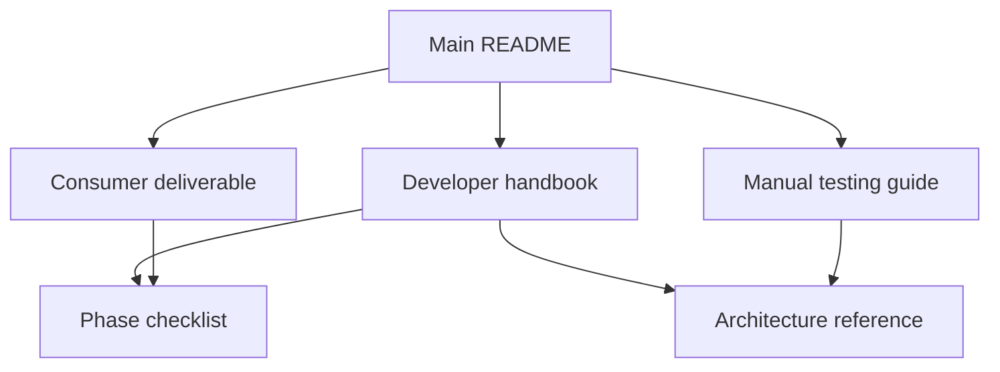

# MatsyaLink AI documentation center

This directory contains the complete engineering, operational, and consumer
documentation for MatsyaLink AI.

## Choose your document

| Reader | Start here | What it contains |
|---|---|---|
| Fisher, cooperative, buyer, judge, or demo operator | [Consumer guide and deliverable](CONSUMER_DELIVERABLE.md) | Product purpose, setup, screens, decisions, demonstrations, responsible use, troubleshooting, acceptance |
| Developer, maintainer, technical reviewer, or deployer | [Developer handbook](DEVELOPER_GUIDE.md) | Architecture, schemas, state ownership, nodes, tools, formulas, integrations, tests, security, extension, roadmap |
| QA reviewer, judge, or demonstration operator | [Manual testing and agentic verification guide](MANUAL_TESTING_GUIDE.md) | Reproducible tests for every feature, three routes, integrations, failures, and agentic proof |
| Architect or technical presenter | [Architecture reference](architecture.md) | System diagram, boundaries, and decision guarantees |
| Project reviewer | [Fifteen-phase checklist](phase-checklist.md) | Requirement-to-implementation mapping |
| First-time visitor | [Main project README](../README.md) | Concise overview and quick start |

## Documentation map



## Source-of-truth order

When documentation and code disagree, use this order while correcting the
documentation or defect:

1. Automated tests for required externally visible behavior
2. Typed contracts in `models.py` and `state.py`
3. Graph topology in `graph.py`
4. Node and tool implementation
5. Developer handbook
6. Consumer guide
7. Main README

Code is not automatically assumed correct; a mismatch against the stated
product requirement should be resolved through review and a regression test.

## Documentation maintenance checklist

Update documentation in the same change when modifying:

- a form field or page;
- a state field or owner node;
- a domain validation rule;
- a graph node, edge, or business route;
- the scoring formula or decision policy;
- a sheet name or column;
- an environment variable;
- email behavior;
- an analytics definition;
- a test or demonstration scenario;
- a known limitation or security control.

Before delivery, verify all Markdown links resolve and run:

```powershell
python -m pytest -q
python scripts/run_demo.py
```

The demo runner persists transactions. Use a disposable ledger when a clean
transaction history is required.
