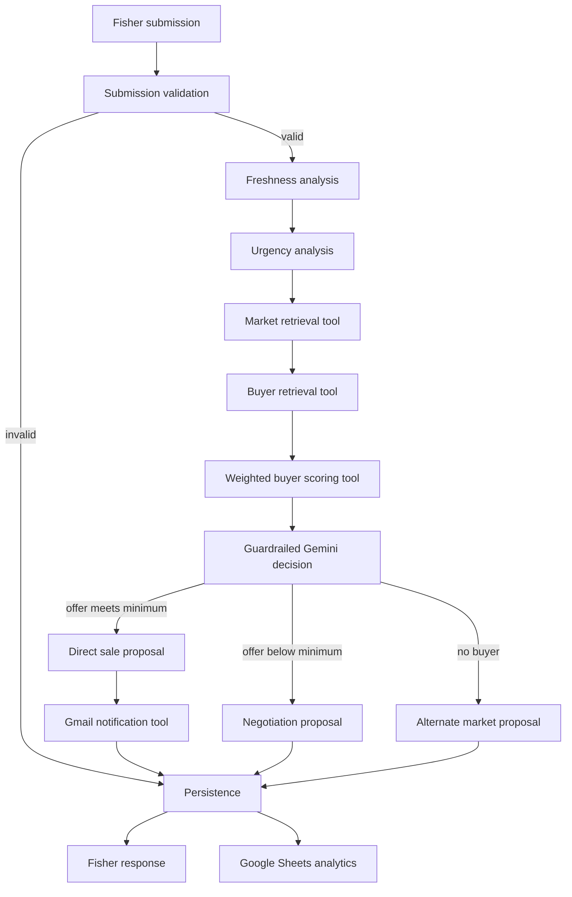

# MatsyaLink AI architecture

MatsyaLink is a stateful decision graph, not a CRUD application. Every node
receives the typed state, writes only its owned result fields plus the shared
append-only execution log, and leaves routing to explicit LangGraph edges.

## Boundaries

| Layer | Modules | Responsibility |
|---|---|---|
| Experience | `templates/frontend.py` | Submission, live graph trace, recommendations, dashboard |
| Orchestration | `graph.py`, `nodes.py`, `state.py` | State transitions, branching, checkpointer, trace |
| Reasoning | `prompts.py`, decision node | Constrained Gemini output with deterministic safety policy |
| Capabilities | `tools.py` | Retrieval, scoring, SMTP, persistence, analytics |
| Domain | `models.py` | Validated and extensible Pydantic entities |
| Infrastructure | `repositories.py`, `config.py` | Google Sheets/CSV adapters and environment configuration |

## Decision guarantees

- Buyer and market IDs must occur in retrieved records.
- Direct sale requires the buyer's stored offer to meet the fisher's minimum.
- The score is recomputable from five visible components.
- A Gemini failure falls back to the same deterministic policy without stopping
  persistence or the fisher response.
- Gmail is isolated behind an email tool and defaults to dry-run.

